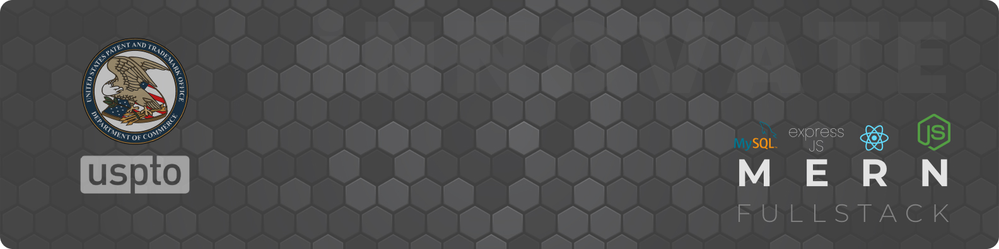

<!-- GitHub Profile Cover Image -->

   
   

# Hi, I'm [Prakash Upadhyay](https://linkedin.com/in/upadhyayprakash)! 👋 

I'm a **Fullstack Developer** and a **[Patent](https://uspto.report/patent/grant/10936288)** holder with 9+ years of experience, passionate about building secure, performant, scalable, and maintainable softwares.

### About Me 💻

My expertise spans from building e-2-e **MERN** stack applications to creating robust backend services and automated GitHub workflows. I also dabble in **UI Design** having designed Web & Mobile Apps, authoring a React.js component library and a design systems ([playui-react](https://github.com/upadhyayprakash/playui-react)), and sharing my years of experience through my [blogs](https://upadhyayprakash.github.io#blogs).

- 🔭 I’m currently building an AI-driven platform to transform rough UI sketches into production-ready **React.js** code.
- 🌱 Exploring the power of **Kafka**, **Redis**, and **Node.js** and microservice patterns for building real-time scalable systems.
- ⚡ Fun fact: I’m also a **[Patent](https://uspto.report/patent/grant/10936288) Holder** with the USPTO!

  
  

### 🔥 GitHub Stats

<!-- Your GitHub Stats -->

<!-- Your Most Used Languages -->

### Recent Projects 🚀

- [PlayUI - React Component Library](https://github.com/upadhyayprakash/playui-react)**
    - A customizable **React.js** component library built with **TypeScript**.
    - Check it out, contribute, and help us grow the open-source library!

### Blogs
- Build a type-safe and maintainable ReactJS component with TypeScript - [Read](https://upadhyayprakash.github.io/blogs/typesafe-reusable-button-component-in-reactjs)

### Languages and Tools
Following are the technologies I've worked on in my Fullstack journey with small and mid-sized startups, enterprises and consultancies.

  

### Get In Touch 📫
Connect with me on [LinkedIn](https://www.linkedin.com/in/upadhyayprakash) or via <a href="mailto:prakash.upadhyay93@yahoo.com?subject=Hey Prakash! Let's discuss">Email</a> to discuss innovative tech or collaboration opportunities!
